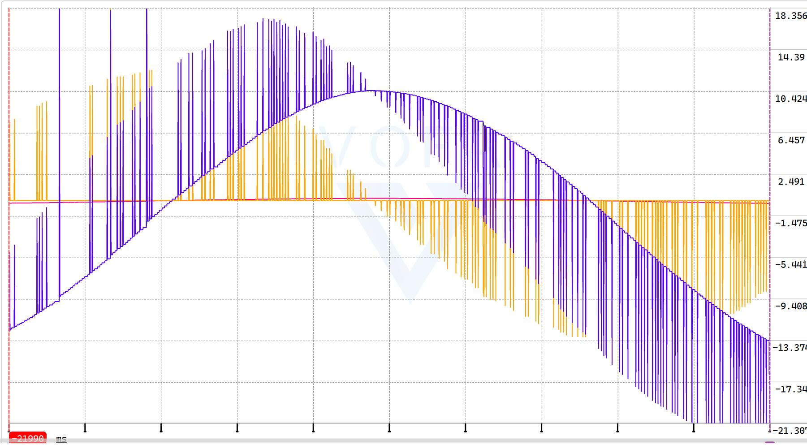

## 主要问题

**问题描述**：拨盘kp调大极其容易震荡，kp小的时候拨盘无力，和C版控制区别相当之大

**问题分析**：可能是通信写的有问题，以`GimbalHWNode::gimbalRecevieCallBack`为例，该线程以10000hz运行

每次收到`case YAW`， `case PITCH`， `case AMMOR`， `case AMMOL`， `case ROTOR`的顺序不同，可能存在数据被挤掉的情况。但是接受各个case又能达到1000hz，满足控制频率要求

### 分析

画出PID的KD项和总输出可以看到下面的图像：

使PID的计算频率小于IMU、电机反馈等等传感器信息的反馈频率可以解决这个问题。

用单片机控制时，这些传感器信息要么是在中断里接收要么是用DMA连续搬运，加上主线程的更新频率小于1khz，所以反馈信息的更新速度一定大于主线程的运行速度，但是在ros里这些信息都是用定时器轮询获取的，更新速度就不一定比主线程还快，PID的微分项就会间歇性有值，长时间保持在0，造成这样的抖动。

**可能解决办法**：

1.阅读[广工的代码](https://github.com/rm-controls/rm_control)，参考他们的实现方式

2.优化所有反馈信息的获取过程，更新速度越快越好，控制线程定频1khz或者以比1khz稍低一些的速率运行

## 其他次要问题

**短期可以解决**：

开机yaw轴抽搐
